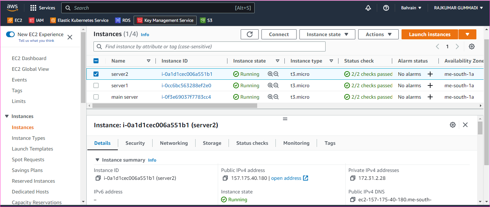

Install HAProxy on Ubuntu 20.04
---------------------------------
  [refer here](https://www.vultr.com/docs/how-to-install-haproxy-on-ubuntu-20-04/?utm_source=performance-max-apac&utm_medium=paidmedia&obility_id=16876059738&utm_adgroup=&utm_campaign=&utm_term=&utm_content=&gclid=Cj0KCQiA2-2eBhClARIsAGLQ2Rmq6I44uo0Dqzv7-y8E95QQryAM1zMKZnkz2NqZyy1psNhTN56NQn0aAk37EALw_wcB)

These steps are for the 3 instances
-----------------------------------
* we need to create 3 ubuntu 20.04 instances
  
* And ensure the sudo permissions are given or not
* Then the PasswordAuthentication can be changed `no to yes`
   
* and restart the sshd service
* after that we need to adduser <username>
* we have to given permission to user
* and Add a user to sudoers file `username  ALL=(ALL:ALL) NOPASSWD:ALL`
  to execute the above steps for all the 3 instances parallelly

# Main Server
--------------
* install the haproxy on main server
```
sudo apt update
sudo apt install haproxy -y
sudo systemctl status haproxy
haproxy -v
```  
  Configure the HaProxy server

* To execute the following commands to configure the haproxy
```
sudo cp /etc/haproxy/haproxy.cfg /etc/haproxy/haproxy.cfg.bk
sudo nano /etc/haproxy/haproxy.cfg
sudo systemctl restart haproxy
```  

