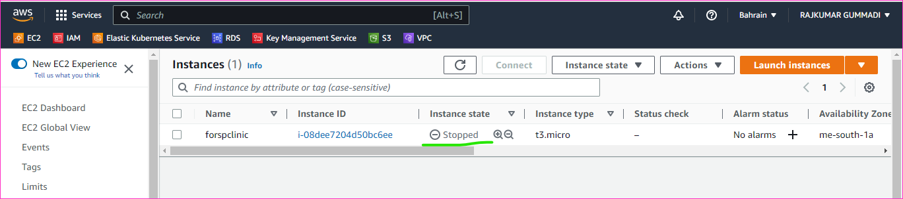
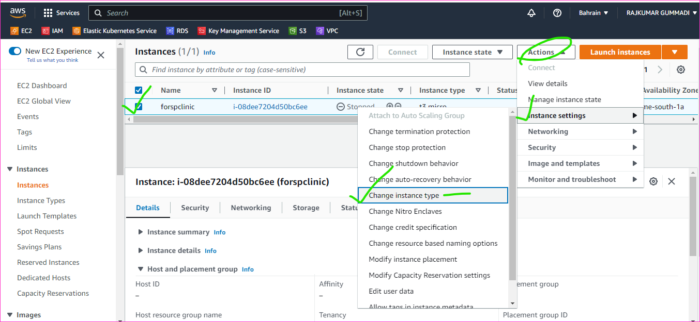
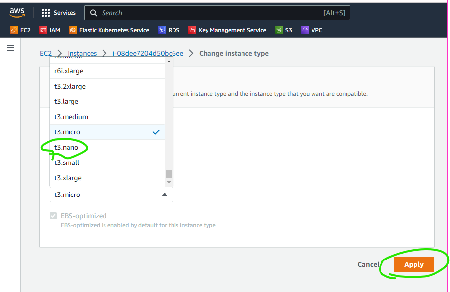
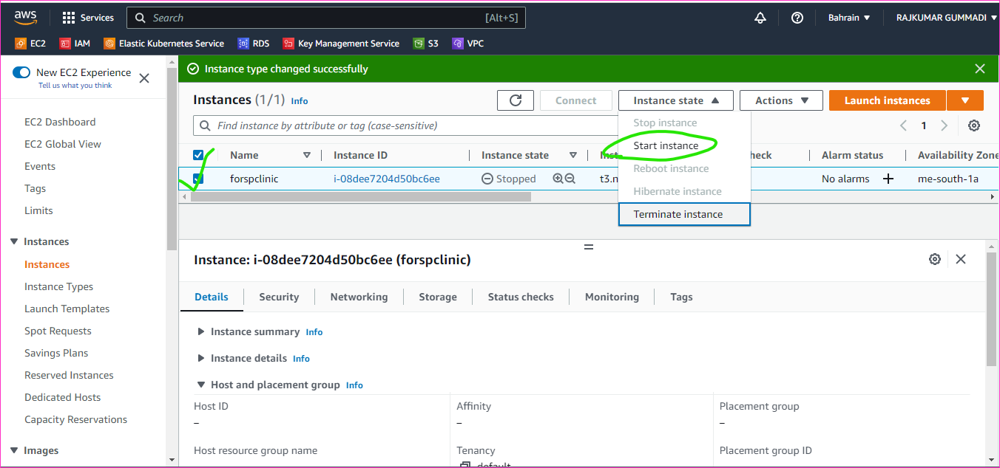
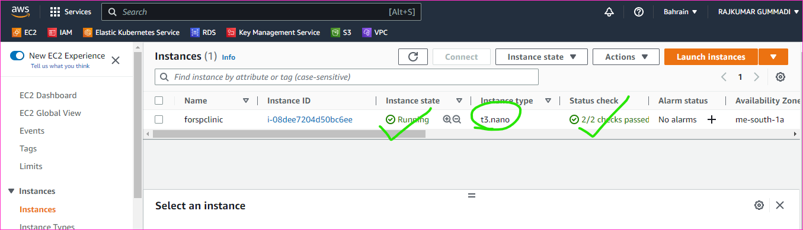

Resize the Instance type
--------------------------

* Firstly create a instance and instance type is t3.micro
* The instance type is resize to t3.nano
* Go to aws console and create a instance with t3.micro and stop the instance state

* And select the instance and go actions and then select the instance settings and then select change instance type

* Change the instance type t3.micro to t3.nano and select apply button

* Select the instance and go to instance state and select the start instance

* Finally we can get the instance type is resized

