Installing Nodejs for the ubuntu machine and pipeline for the same thing
-------------------------------------------------------------------------------
* write the yaml file for the nodejs application 
* First run the manually to excute the steps 
```
git clone git@github.com:rwieruch/node-express-server.git
cd node-express-server
npm install
npm start
```
* In the above commands we have to got an error like below
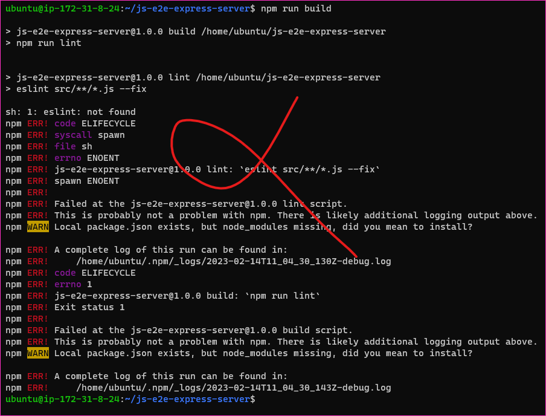

* and take another link to run the same commands
```
git clone https://github.com/Azure-Samples/js-e2e-express-server
cd js-e2e-express-server
npm install
npm run build
npm start
```
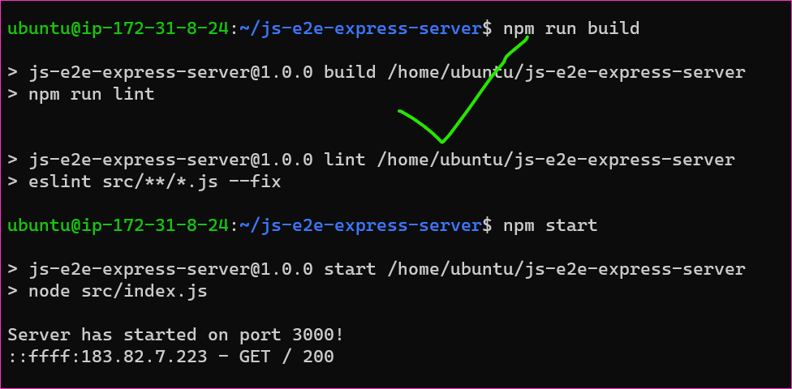
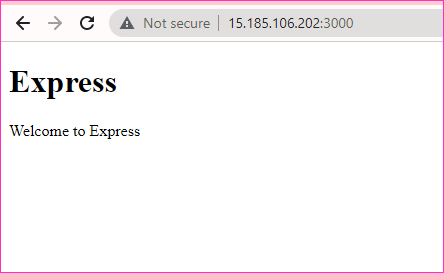


> next run the pipeline for the nodejs

```yaml
---
pool: 
  name: "Azure Pipelines"
  vmImage: ubuntu-latest

trigger:
  - main
  
steps:
  - task: NodeTool@0
    inputs:
      versionSpec: 16.x
    displayName: 'Install Node.js'
  - task: Npm@1
    inputs:
      command: install
    displayName: 'npm install' 
  - task: Npm@1
    inputs:
      command: run build
    displayName: 'npm run build'
```
> Yaml file for the nodejs application [refer here](https://github.com/qtrajkumar/Ansible_Zone/blob/main/Tasks%20in%20JOIP/nodejspl.yaml)    
clone the code https://github.com/Azure-Samples/js-e2e-express-server
and go to pipeline and select the new pipeline
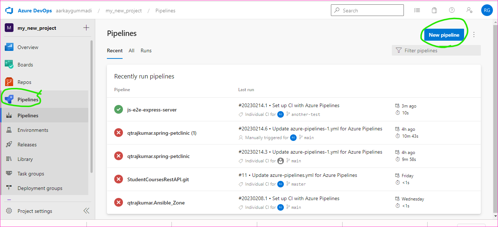
after that go to Azure Repos Git and select the js e2e-express-server
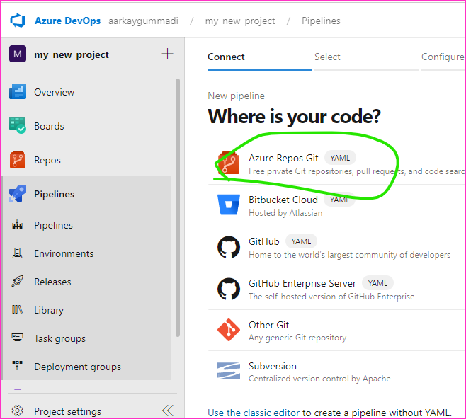
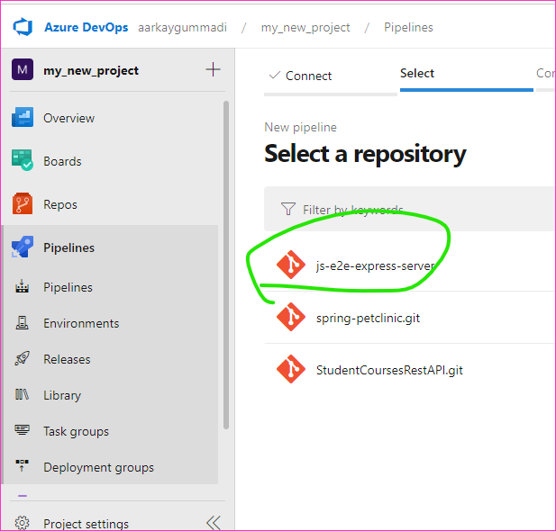
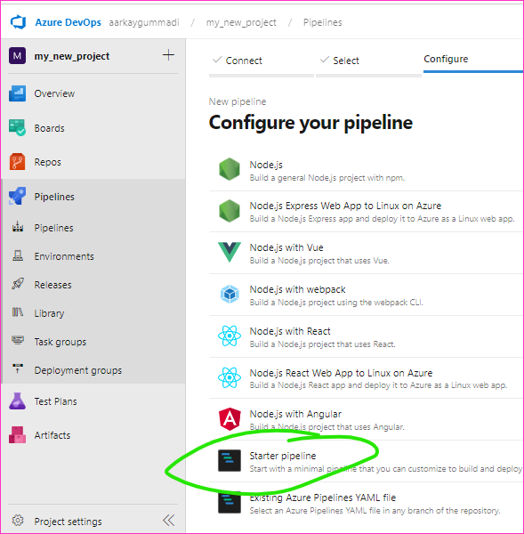
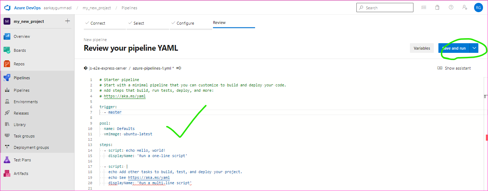
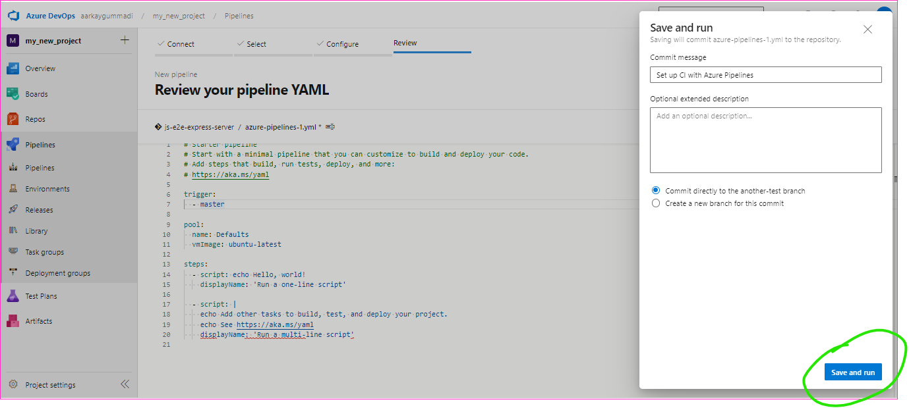
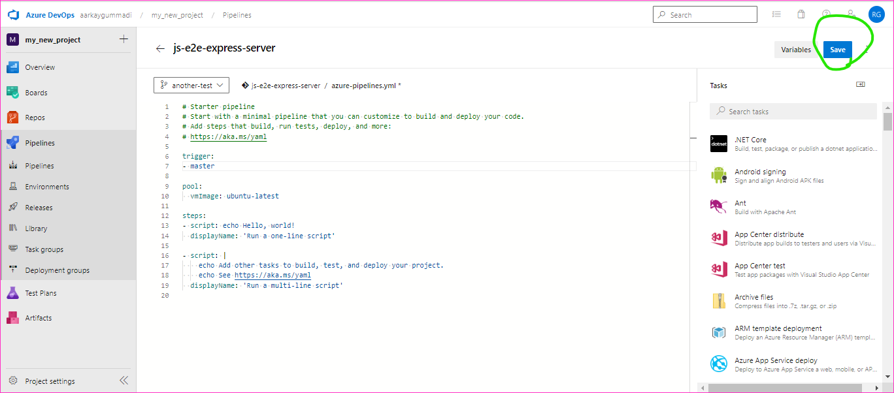
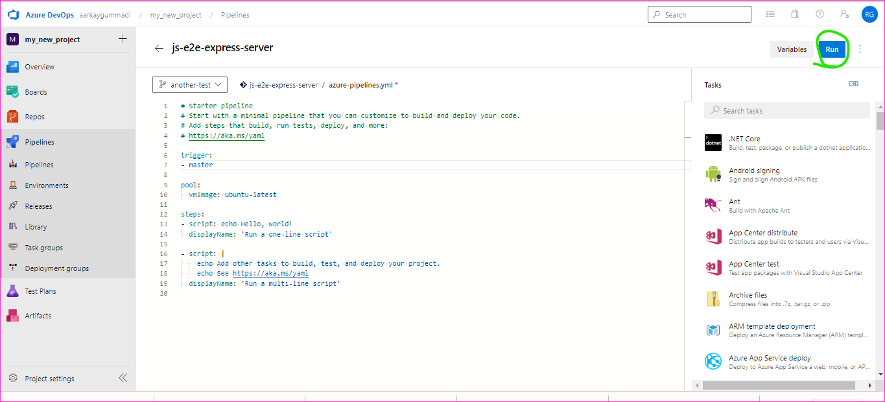
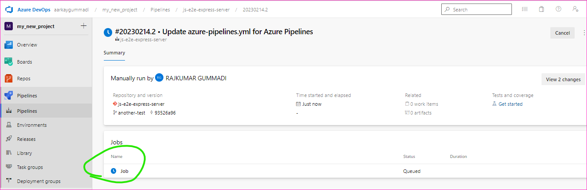
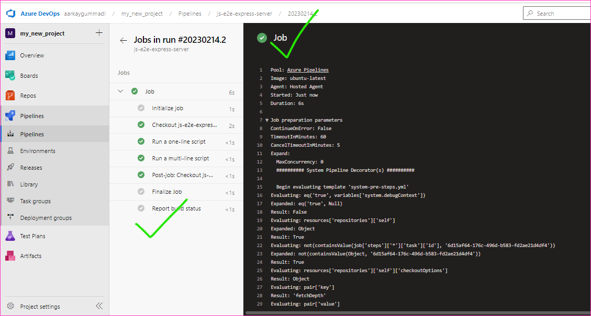
 
* The above pipeline was not working

* To change the pipeline [refer here]()
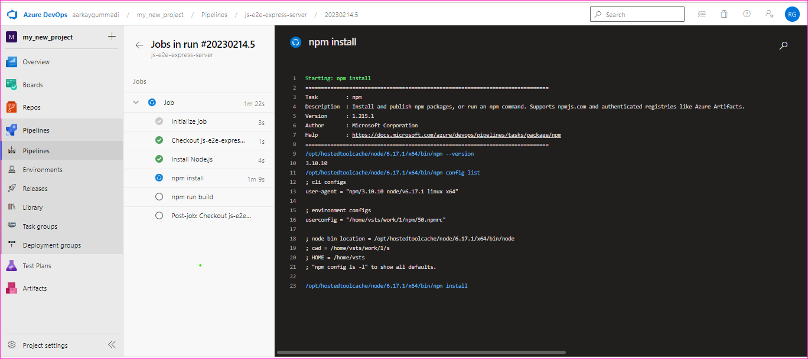

> [refer here](https://github.com/qtrajkumar/Ansible_Zone/blob/main/Tasks%20in%20JOIP/nodejspl.yaml) for the yaml file for nodejs
* Finally Completed the task for our needs 

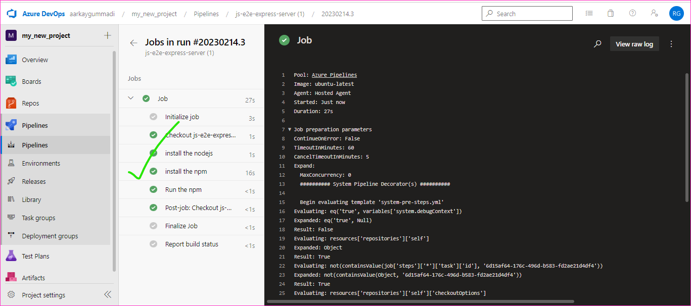
