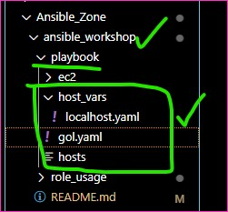
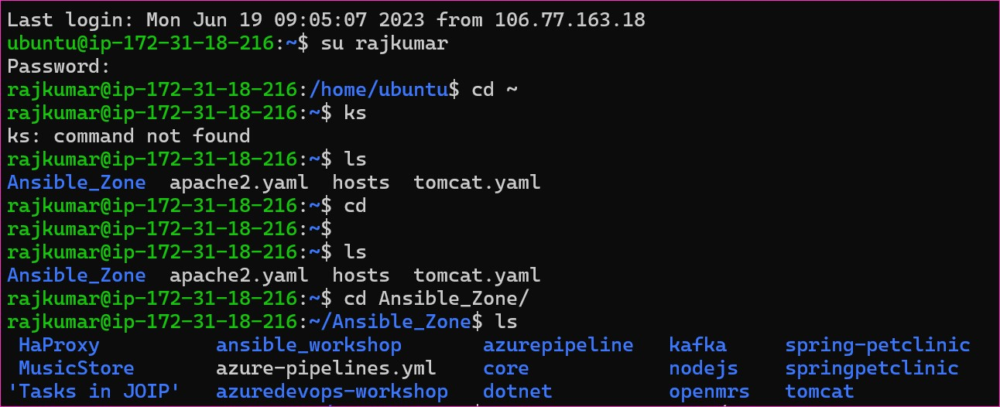

Ansible Workshop
----------------
### Game of life
* To run this project with need tomcat with jdk 8
* In the webapps folder of tomcat we need to copy gameoflife.war
* Manual steps for ubuntu 22.04
```
sudo apt update
sudo atp install openjdk-8-jdk tomcat9 -y
cd /tmp
wget https://referenceapplicationskhaja.s3.us-west-2.amazonaws.com/gameoflife.war
sudo cp gameoflife.war /var/lib/tomcat9/webapps/gameoflife.war .
```
* Access the application over `http://<public-ip>:8080/gameoflife


### Activity-1: Write a ansible playbook to automate the above steps

* host_vars
    * localhost
```yaml
---
packages:
  - openjdk-8-jdk
  - tomcat9
source_location: https://referenceapplicationskhaja.s3.us-west-2.amazonaws.com/gameoflife.war
target_location: /var/lib/tomcat9/webapps/gameoflife.war
tomcat9_service: tomcat9
```

* gol.yaml file
```yaml
---
- name: Install java and tomcat9 on ubuntu 22.04
  hosts: all
  become: yes
  tasks: 
    - name: install java-8 & tomcat9
      ansible.builtin.apt:
        name: "{{ packages }}"
        state: present
        update_cache: yes
    - name: download game of life
      ansible.builtin.get_url:
        url: "{{ source_location }}"
        dest: "{{ target_location }}"
      notify:
        - restart tomcat9  
  handlers:
    - name: restart tomcat9
      ansible.builtin.service:
        name: "{{ tomcat9_service }}"
        state: restarted   
```
* hosts
```yaml
localhost
```
* [Refer Here](https://github.com/qtrajkumar/Ansible_Zone/tree/main/ansible_workshop/playbook) for the playbook



### Activiry-2: Write a role for gameoflife

### Activity-3: Integrating ansible with jenkins
* We have pipeline
```
pipeline {
    agent { label 'node1'}
    stages {
        steps {
            git 
            sh 'cd role_usage && ansible-playbook -i hosts gol.yaml'
        }
    }
}
```
* Execute build on jenkins


Terraform with Ansible
----------------------
* 
